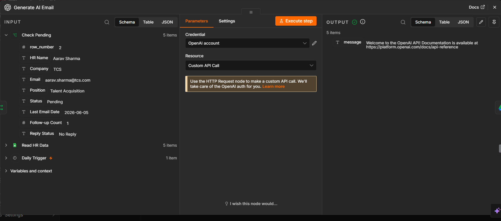
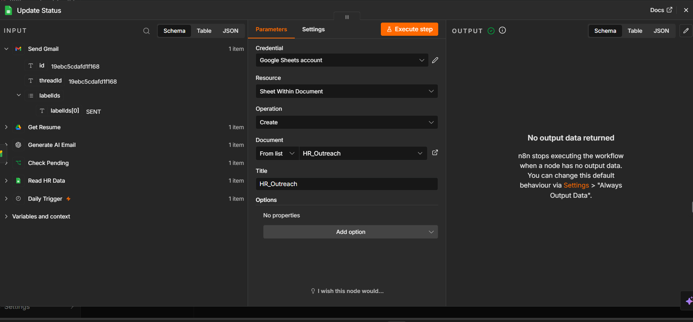
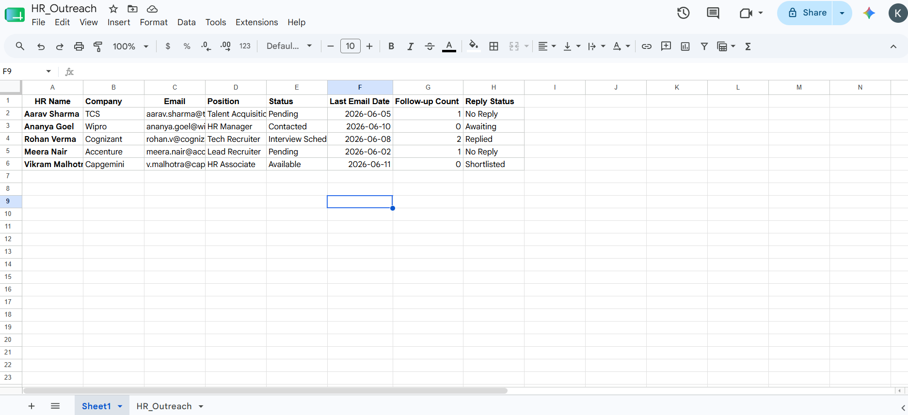

# 🚀 HR Outreach Automation System

[Banner](n8n/workflow.png)

## 📌 Overview

Built an AI-Powered HR Outreach Automation System using n8n & AI.

Job seekers often spend hours manually searching for HR contacts, writing personalized emails, and following up on applications. This repetitive process is time-consuming and inefficient.

To solve this problem, I built an automated HR Outreach Automation System that streamlines the entire outreach process using AI and workflow automation.

---

## 🔹 Features

✅ HR Data Management using Google Sheets

✅ AI-Powered Personalized Email Generation

✅ Automated Email Sending via Gmail

✅ Resume Attachment Support

✅ HR Response Tracking

✅ AI-Based Reply Classification

✅ Automatic Follow-Up Emails

✅ Follow-Up Count Management

✅ Application Status Tracking Dashboard

---

## 🛠️ Tech Stack

* n8n
* OpenAI / Google Gemini AI
* Gmail API
* Google Sheets
* Google Drive
* JavaScript
* Workflow Automation

---

## 🔄 Complete Workflow

HR Data Collection → AI Email Generation → Gmail Automation → Response Tracking → AI Reply Analysis → Automatic Follow-Up → Status Update

## ✉️ AI Email Generation

Automatically generates personalized HR outreach emails based on company, role, and candidate profile.

---

## 📩 Response Tracking & Classification

AI analyzes incoming HR responses and categorizes them into different statuses.

---

## 📊 Application Tracking Dashboard

Track all outreach activities, application status, follow-up counts, and HR responses from a centralized dashboard.

---

## 🔍 AI Capabilities

* Personalized Email Generation
* Intelligent Response Classification
* Automated Follow-Up Generation
* Application Status Tracking
* AI-Based Communication Assistance

---

## 📁 Database Structure

| Field           | Description        |
| --------------- | ------------------ |
| HR Name         | HR Contact Name    |
| Company         | Company Name       |
| Email           | HR Email           |
| Position        | Applied Position   |
| Status          | Current Status     |
| Last Email Date | Last Email Sent    |
| Follow-up Count | Total Follow-ups   |
| Reply Status    | HR Response Status |

---

## 💡 Key Learnings

This project helped me understand:

* AI Workflow Automation
* Prompt Engineering
* Email Automation
* Google Workspace Integrations
* API Integration
* Workflow Engineering with n8n
* No-Code/Low-Code Development
* AI-Powered Business Process Automation

---

## 🚀 Future Enhancements

* LinkedIn Outreach Automation
* Multi-Channel Follow-Ups
* HR Sentiment Analysis
* Resume Matching Engine
* Analytics Dashboard

---

## 👨‍💻 Author

Khushal Dak

📧 AI Automation | Data Analytics | Workflow Engineering

GitHub:https://github.com/Kumkum-lohiya

LinkedIn:https://www.linkedin.com/in/kumkum-lohiya/
